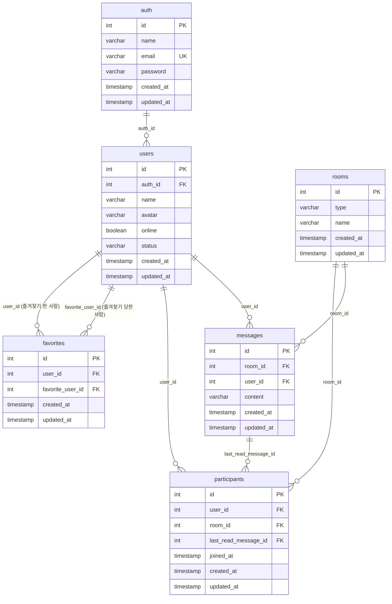

# Database — 테이블 관계도

> 스키마 원본: [`apps/web/src/database.dbml`](apps/web/src/database.dbml)

## ER 다이어그램



## 관계 요약

| 관계 | 카디널리티 | FK | 설명 |
|------|-----------|-----|------|
| `auth` → `users` | 1 : N | `users.auth_id` | 로그인 계정과 채팅 프로필. 보통 1:1로 쓰지만 스키마상 1:N 허용 |
| `users` ↔ `users` | N : M | `favorites` | 즐겨찾기 (자기참조). A→B만 저장, 양방향 아님 |
| `users` ↔ `rooms` | N : M | `participants` | 방 참여. DM·그룹 모두 participants로 표현 |
| `rooms` → `messages` | 1 : N | `messages.room_id` | 방 하나에 메시지 여러 개 |
| `users` → `messages` | 1 : N | `messages.user_id` | 유저가 작성한 메시지 |
| `messages` → `participants` | 1 : N | `participants.last_read_message_id` | 방별 읽음 위치 (안 읽음 계산용) |

## 테이블 역할

### `auth` — 인증

로그인에 쓰는 계정 정보.

| 컬럼 | 설명 |
|------|------|
| `email` | 로그인 ID (unique) |
| `password` | 비밀번호 |
| `name` | auth 이름 |

### `users` — 프로필

채팅 UI에 노출되는 유저 정보. `auth`와 분리.

| 컬럼 | 설명 |
|------|------|
| `auth_id` | 소속 auth |
| `name`, `avatar` | 표시 이름·아바타 |
| `online`, `status` | 온라인 여부·상태 메시지 |

### `favorites` — 즐겨찾기

| 컬럼 | 설명 |
|------|------|
| `user_id` | 즐겨찾기 **한** 사람 |
| `favorite_user_id` | 즐겨찾기 **당한** 사람 |

### `rooms` — 채팅방

| 컬럼 | 설명 |
|------|------|
| `type` | `dm` 또는 `group` |
| `name` | 그룹방 이름 (`dm`이면 null) |

### `participants` — 방 참여 + 읽음

| 컬럼 | 설명 |
|------|------|
| `user_id`, `room_id` | 누가 어떤 방에 있는지 |
| `last_read_message_id` | 이 id **이후** 메시지 수 = 안 읽은 메시지 수 |
| `joined_at` | 입장 시점 (재입장 시 이 값만 갱신) |

### `messages` — 메시지

| 컬럼 | 설명 |
|------|------|
| `room_id` | 속한 방 |
| `user_id` | 작성자 |
| `content` | 메시지 내용 |

## 데이터 흐름 예시

### 로그인 → 프로필

```
auth (email/password) ──1:N──> users (name, avatar, online)
```

```sql
SELECT u.*
FROM auth a
JOIN users u ON u.auth_id = a.id
WHERE a.email = 'user@example.com';
```

### DM / 그룹방 목록

```
users ──participants──> rooms
```

```sql
SELECT r.*
FROM participants p
JOIN rooms r ON r.id = p.room_id
WHERE p.user_id = :myUserId;
```

- **DM**: `rooms.type = 'dm'`, `participants` 2명
- **그룹**: `rooms.type = 'group'`, `rooms.name` 사용

### 채팅 메시지 + 작성자

```
rooms ──1:N──> messages ──N:1──> users
```

```sql
SELECT m.*, u.name, u.avatar
FROM messages m
JOIN users u ON u.id = m.user_id
WHERE m.room_id = :roomId
ORDER BY m.created_at;
```

### 안 읽은 메시지 수

```
participants.last_read_message_id ──> messages.id
```

```sql
SELECT COUNT(*) AS unread_count
FROM messages m
JOIN participants p
  ON p.room_id = m.room_id AND p.user_id = :myUserId
WHERE m.room_id = :roomId
  AND m.id > COALESCE(p.last_read_message_id, 0);
```

### 즐겨찾기 목록

```
users ──favorites──> users (자기참조)
```

```sql
SELECT u.*
FROM favorites f
JOIN users u ON u.id = f.favorite_user_id
WHERE f.user_id = :myUserId;
```

## 조인 치트시트

| 기능 | 조인 경로 |
|------|-----------|
| 로그인 + 프로필 | `auth` → `users` |
| 내 방 목록 | `users` → `participants` → `rooms` |
| 방 메시지 | `rooms` → `messages` → `users` |
| 안 읽음 | `participants` + `messages` (id 비교) |
| 즐겨찾기 친구 | `users` → `favorites` → `users` |
